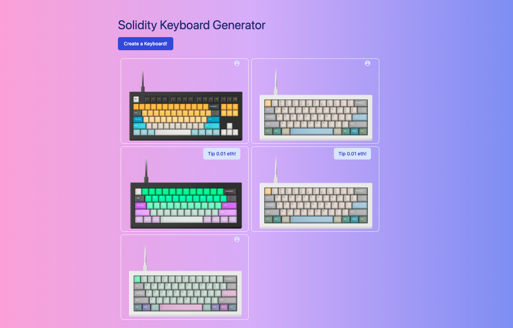

# Mechanical-Keyboard

> A web app that will allow you to create an on-chain mechanical keyboard, view other users' keyboards, and send an ETH tip to your favorites!

| Screenshot |
| :--------: |

### **Welcome!**

To get started with this project, clone this repo and follow these commands:

- Run the frontend

  1. Run `npm install` at the root of your directory
  2. Run `npm run dev` to start the project
  3. Start coding!

- Run the smart contract
  npx hardhat run scripts/run.js

👤 **Muhammad Sesay**

- GitHub: [@mmsesay](https://github.com/mmsesay)
- Twitter: [@DeeMaejor](https://twitter.com/DeeMaejor)
- LinkedIn: [LinkedIn](https://linkedin.com/in/muhammad-m-sesay)

### Acknowledgments

- [pointer.gg](https://www.pointer.gg/) for providing this awesome tutorial on how to get started with building a Web3 App with solidity + Ethereum Smart Contracts
